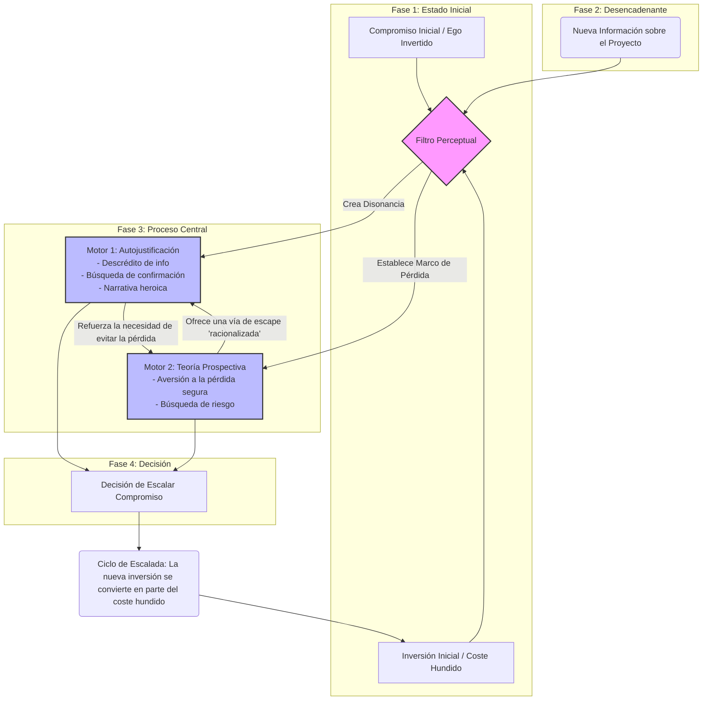

```mermaid
graph TD
    subgraph Fase 1: Estado Inicial
        A[Compromiso Inicial / Ego Invertido] --> C{Filtro Perceptual};
        B[Inversión Inicial / Coste Hundido] --> C;
    end

    subgraph Fase 2: Desencadenante
        Info(Nueva Información sobre el Proyecto) --> C;
    end

    subgraph Fase 3: Proceso Central
        C -- Crea Disonancia --> M1[Motor 1: Autojustificación<br/>- Descrédito de info<br/>- Búsqueda de confirmación<br/>- Narrativa heroica];
        C -- Establece Marco de Pérdida --> M2[Motor 2: Teoría Prospectiva<br/>- Aversión a la pérdida segura<br/>- Búsqueda de riesgo];
        M1 -- Refuerza la necesidad de evitar la pérdida --> M2;
        M2 -- Ofrece una vía de escape 'racionalizada' --> M1;
    end

    subgraph Fase 4: Decisión
        M1 --> D[Decisión de Escalar Compromiso];
        M2 --> D;
    end

    D --> Loop(Ciclo de Escalada: La nueva inversión se convierte en parte del coste hundido);
    Loop --> B;

    style C fill:#f9f,stroke:#333,stroke-width:2px
    style M1 fill:#bbf,stroke:#333,stroke-width:2px
    style M2 fill:#bbf,stroke:#333,stroke-width:2px

```
