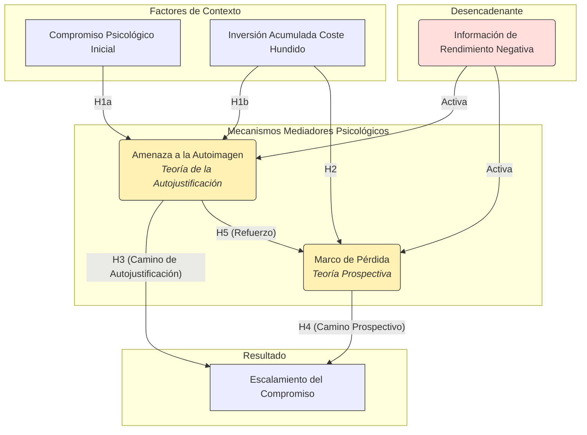

```mermaid
graph TD
    subgraph Factores de Contexto 
        A[Compromiso Psicológico Inicial]
        B[Inversión Acumulada Coste Hundido]
    end

    subgraph Desencadenante
        C(Información de Rendimiento Negativa)
    end

    subgraph Mecanismos Mediadores Psicológicos
        M1(Amenaza a la Autoimagen<br/><i>Teoría de la Autojustificación</i>)
        M2(Marco de Pérdida<br/><i>Teoría Prospectiva</i>)
    end

    subgraph Resultado
        E[Escalamiento del Compromiso]
    end

    %% Definiendo las relaciones
    A -- H1a --> M1
    B -- H1b --> M1
    C -- Activa --> M1

    B -- H2 --> M2
    C -- Activa --> M2
    
    M1 -- H3 (Camino de Autojustificación) --> E
    M2 -- H4 (Camino Prospectivo) --> E

    M1 -- H5 (Refuerzo) --> M2

    %% Estilos para mayor claridad
    style A fill:#lightblue,stroke:#333
    style B fill:#lightblue,stroke:#333
    style C fill:#ffdddd,stroke:#333
    style M1 fill:#fff0b3,stroke:#333
    style M2 fill:#fff0b3,stroke:#333
    style E fill:#fffffff,stroke:#333


```
